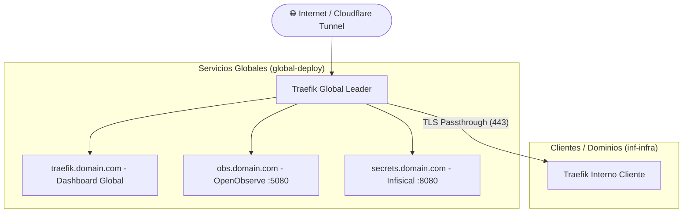

# 🌐 Global Deploy Infrastructure

Infraestructura global de enrutamiento, proxy inverso y servicios compartidos basada en **Traefik v3**, **OpenObserve**, **Infisical** y **Cloudflare Tunnel**.

Actúa como el punto de entrada principal del servidor, gestionando el tránsito de red (`global-transit-network`), la terminación TLS, el enrutamiento hacia stacks internos de clientes y la recolección de logs/métricas.

---

## 🏛️ Arquitectura



---

## 📦 Servicios Incluidos

| Servicio | Subdominio | Puerto Interno | Descripción |
| :--- | :--- | :---: | :--- |
| **Traefik Global** | `traefik.<GLOBAL_DOMAIN>` | `:80` / `:443` | Proxy líder y enrutador principal con routers duales HTTP/HTTPS. |
| **OpenObserve** | `obs.<GLOBAL_DOMAIN>` | `:5080` | Plataforma de analítica de logs, métricas y trazas en tiempo real. |
| **Infisical** | `secrets.<GLOBAL_DOMAIN>` | `:8080` | Gestor centralizado de secretos y variables de entorno para equipos. |
| **Infisical PostgreSQL** | *Interno* | `:5432` | Base de datos dedicada para Infisical (red aislada). |
| **Infisical Redis** | *Interno* | `:6379` | Cache y bus de eventos para Infisical. |
| **Cloudflare Tunnel** | *Conector* | - | Agente seguro `cloudflared` para conexión Zero Trust sin abrir puertos. |

---

## 🚀 Despliegue Rápido

### 1. Configuración de Variables
Duplica el archivo `.env.example` y ajusta tus credenciales:
```bash
cp .env.example .env
```

### 2. Crear la Red de Tránsito Global
Si es la primera vez que se inicia el servidor, asegúrate de que la red externa exista:
```bash
docker network create global-transit-network || true
```

### 3. Iniciar la Pila Global
```bash
# Iniciar servicios principales (Traefik, OpenObserve, Infisical)
docker compose up -d

# Si utilizas Cloudflare Tunnel en este stack:
docker compose --profile tunnel up -d
```

---

## 🛡️ Seguridad y Cloudflare Zero Trust

- **Routers Duales**: Cada servicio global cuenta con routers HTTP (puerto 80) y HTTPS (puerto 443 con TLS) para garantizar compatibilidad con Cloudflare Tunnel.
- **Acceso Protegido**: Se recomienda proteger los subdominios administrativos (`traefik`, `obs`, `secrets`) mediante políticas de **Cloudflare Access (PIN por correo / SSO)**.
- **Aislamiento**: Infisical DB y Redis operan en la red interna `infisical-internal`, inaccesible desde el exterior.
